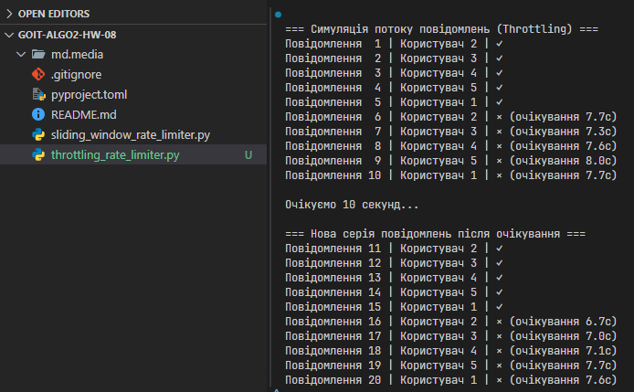

# Алгоритми контролю потоку та обмеження швидкості

## Завдання 1. Реалізація Rate Limiter з використанням алгоритму Sliding Window для обмеження частоти повідомлень у чаті

У чат-системі необхідно реалізувати механізм обмеження частоти повідомлень від користувачів для запобігання спаму. Реалізація повинна використовувати алгоритм Sliding Window для точного контролю часових інтервалів, який дозволяє відстежувати кількість повідомлень у заданому часовому вікні й обмежувати користувачів у надсиланні повідомлень, якщо ліміт перевищено.

**Технічні умови**

1. Реалізація повинна використовувати алгоритм Sliding Window для точного контролю часових інтервалів.

2. Базові параметри системи: розмір вікна (window_size) — 10 секунд і максимальна кількість повідомлень у вікні (max_requests) — 1.

3. Реалізуйте клас `SlidingWindowRateLimiter`.

4. Реалізуйте методи класу:

- `_cleanup_window` — для очищення застарілих запитів з вікна та оновлення активного часового вікна;
- `can_send_message` — для перевірки можливості відправлення повідомлення в поточному часовому вікні;
- `record_message` — для запису нового повідомлення й оновлення історії користувача;
- `time_until_next_allowed` — для розрахунку часу очікування до можливості відправлення наступного повідомлення.

5. Структура даних для зберігання історії повідомлень — `collections.deque`.

**Критерії прийняття**

1. При спробі відправити повідомлення раніше ніж через 10 секунд повертається методом `can_send_message` значення `False`.

2. При першому повідомленні від користувача завжди повертається `True`.

3. При видаленні всіх повідомлень з вікна користувача видаляється запис про користувача зі структури даних.

4. Метод `time_until_next_allowed` повертає час очікування в секундах.

5. Тестова функція згідно з прикладом прогнана й працює відповідно до очікувань.

## Рішення 1

[sliding_window_rate_limiter.py](sliding_window_rate_limiter.py)

## Завдання 2. Реалізація Rate Limiter з використанням алгоритму Throttling для обмеження частоти повідомлень у чаті

У чат-системі необхідно реалізувати механізм обмеження частоти повідомлень від користувачів для запобігання спаму. Реалізація повинна використовувати алгоритм Throttling для контролю часових інтервалів між повідомленнями, який забезпечує фіксований інтервал очікування між повідомленнями користувача й обмежує частоту відправки, якщо цього інтервалу не дотримано.

**Технічні умови**

1. Реалізація повинна використовувати алгоритм Throttling для контролю часових інтервалів.

2. Базовий параметр системи: мінімальний інтервал між повідомленнями (min_interval) — 10 секунд.

3. Реалізуйте клас `ThrottlingRateLimiter`.

4. Реалізуйте методи класу:

- `can_send_message` — для перевірки можливості відправлення повідомлення на основі часу останнього повідомлення;
- `record_message` — для запису нового повідомлення з оновленням часу останнього повідомлення;
- `time_until_next_allowed` — для розрахунку часу до можливості відправлення наступного повідомлення.

5. Структура даних для зберігання часу останнього повідомлення — `Dict[str, float]`.

**Критерії прийняття**

1. При спробі відправити повідомлення раніше ніж через 10 секунд після попереднього повертається методом `can_send_message` значення `False`.

2. При першому повідомленні від користувача завжди повертається `True`.

3. Метод `time_until_next_allowed` повертає час очікування в секундах до наступного дозволеного повідомлення.

4. Тестова функція згідно з прикладом прогнана й працює відповідно до очікувань.

## Рішення 2

[throttling_rate_limiter.py](throttling_rate_limiter.py)

